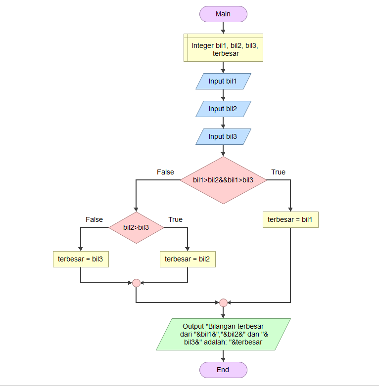
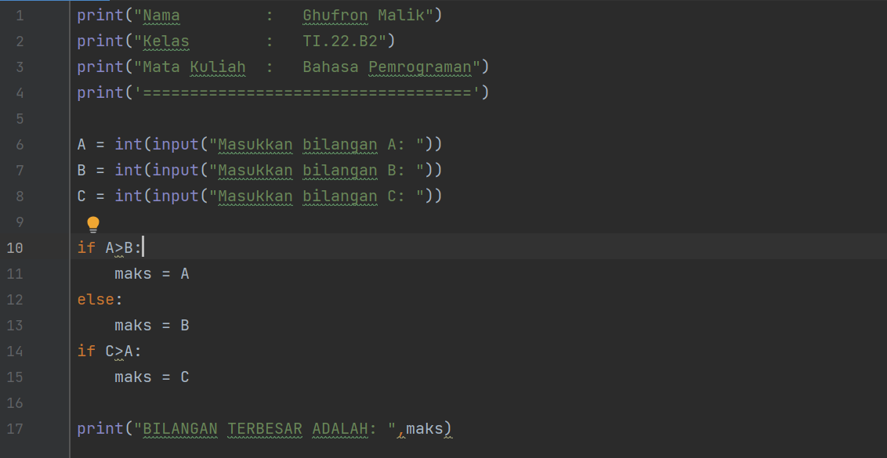
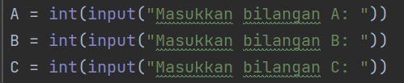
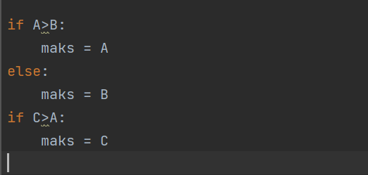
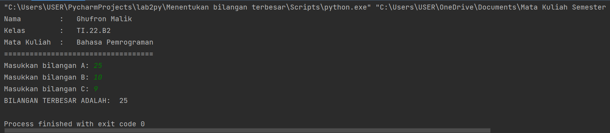

### Nama         :   Ghufron Malik
### Kelas        :   TI.22.B2
### Mata Kuliah  :   Bahasa Pemrograman

# **MENENTUKAN BILANGAN TERBESAR DARI 3 BUAH BILANGAN YANG DI INPUT**

Mari kita jabarkan proses membuat program Praktikum 2 dengan bahasa Python.

**Konsep Dasar**

Berikut adalah Flowchart Program pada Praktikum 2

dari Flowchart di atas kita bisa membuat program sederhana seperti ini:

**Penjabaran Program**

Langkah Pertama kita membutuhkan 4 variabel, yaitu: A,B,C dan *maks* ntuk menampung nilai yang akan diinput oleh user lalu input yang sebelumnya string di konversi ke integer menggunakan fungsi *build-n int()* seperti ini.

langkah selanjutnya kita bandingkan dengan operator '>' lalu kita cek dengan *if else* seperti ini.

Nahh, nilai yang sebelumnya kita bandingkan kita tampung pada variabe *maks* yang nilainya berubah ubah berdasarkan nilai *A,B* dan *C*. Maka jika program dijalankan hasilnya akan seperti ini.

## **Happy Coding, Semoga Bermanfaat**